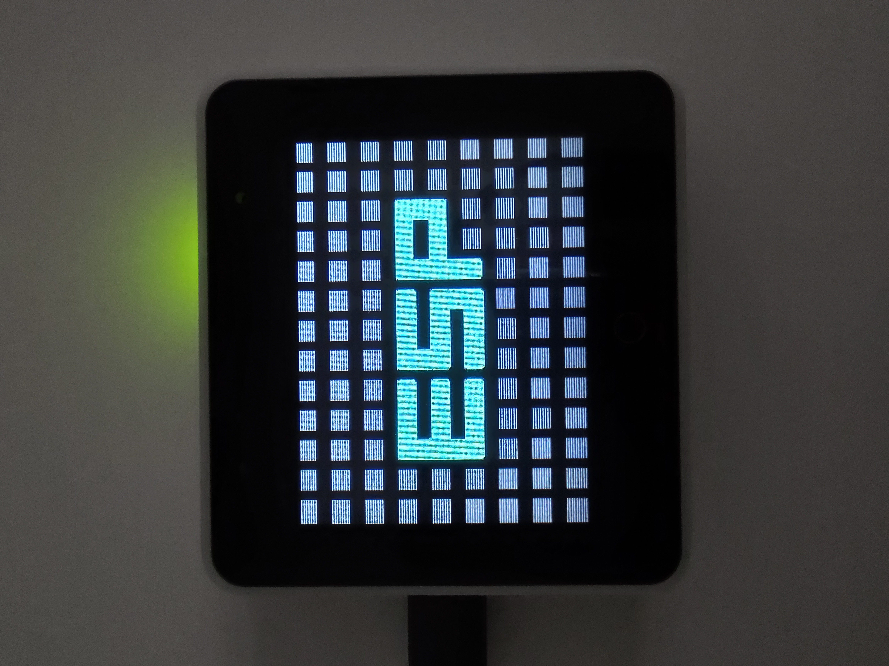

<!-- PROJECT LOGO -->
<br />
<div align="center">
  <a href="https://github.com/sambenko/esp32s3-box-examples">
    
  </a>

<h3 align="center">ESP32S3-BOX Examples</h3>

  <p align="center">
    A repository of examples for esp32s3-box written in Rust
  </p>
</div>

## Usage

```sh
   cargo espflash --release --monitor
```
produces

<div align="center">
  <a href="https://github.com/github_username/repo_name">
    
  </a>
</div>

and to run my first animation example:
```sh
   cargo espflash --release --monitor --example checker_animation
```
<div align="center">
  <a href="https://github.com/github_username/repo_name">
    
  </a>
</div>
