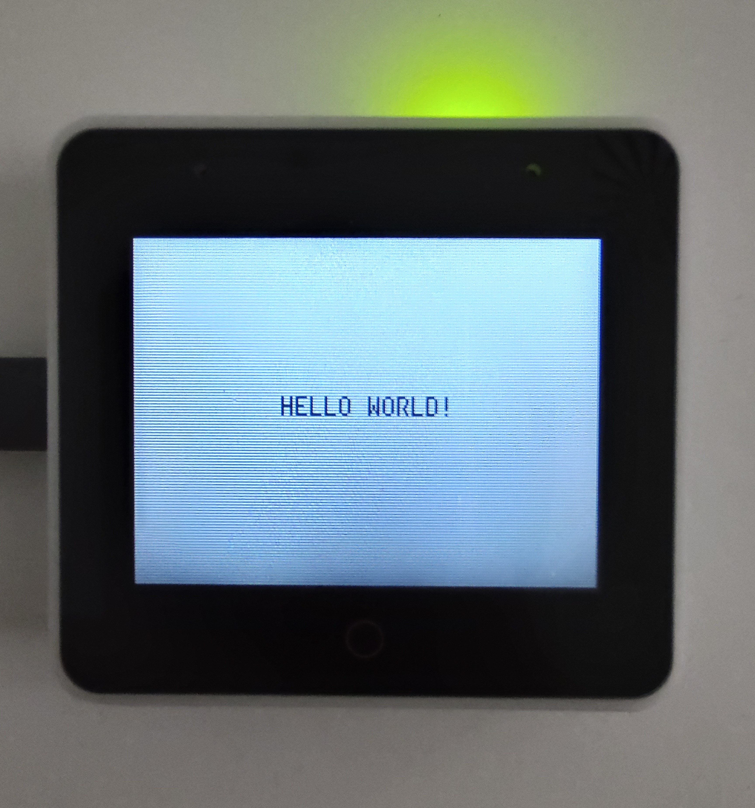
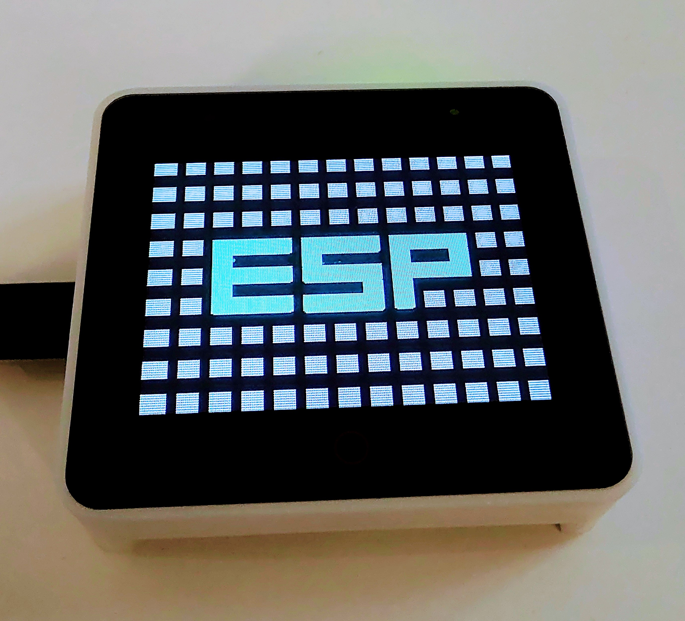
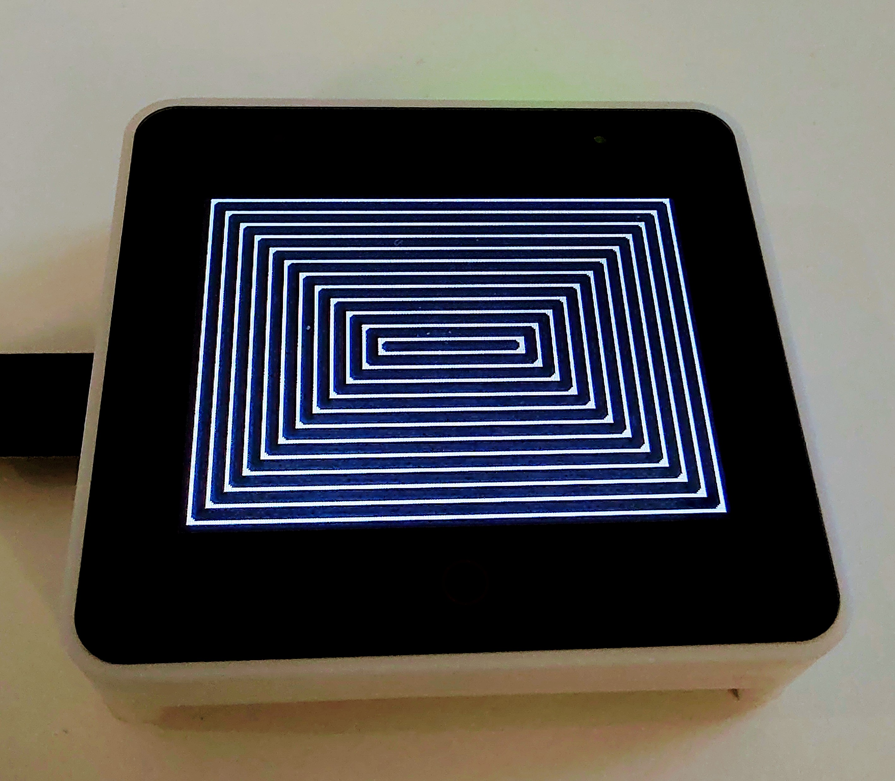
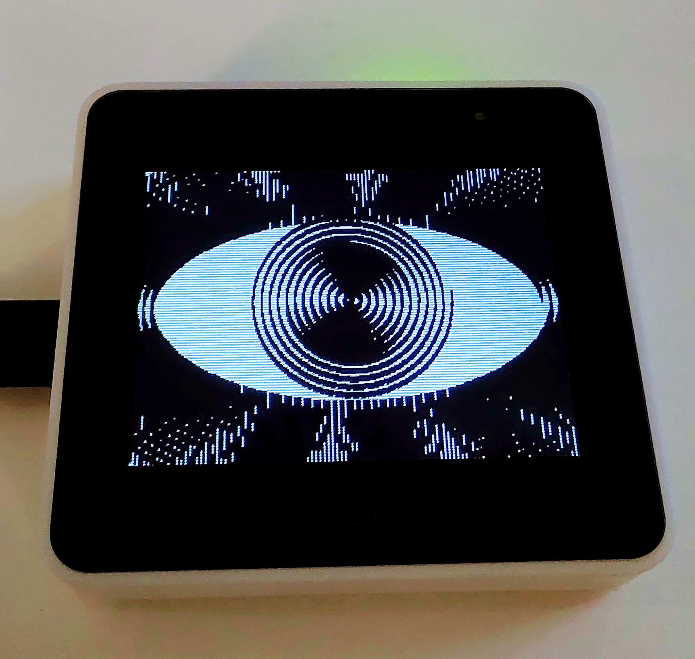
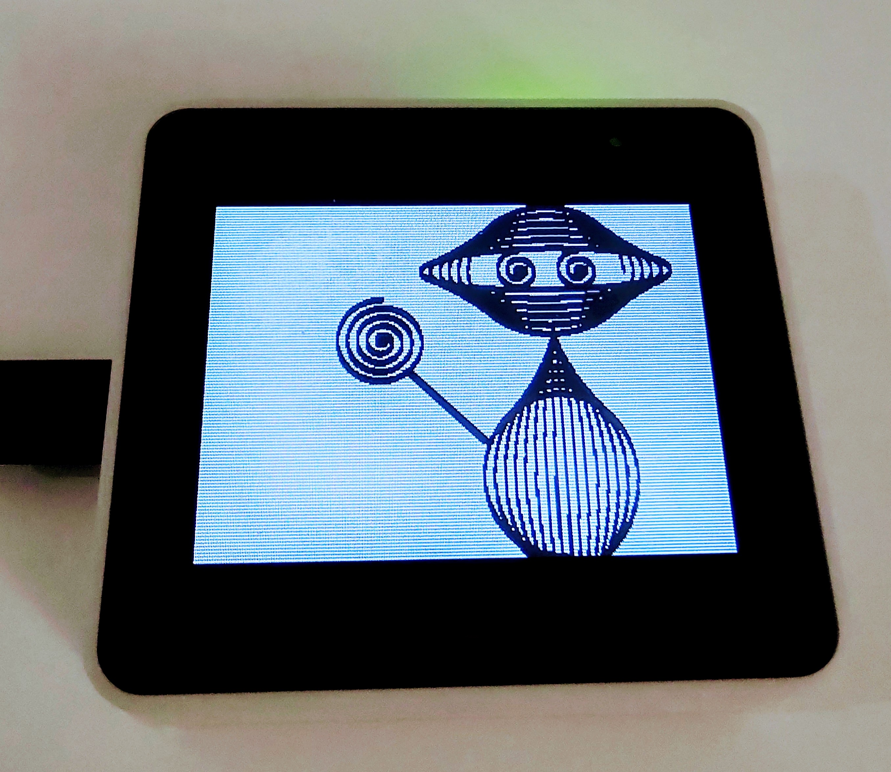
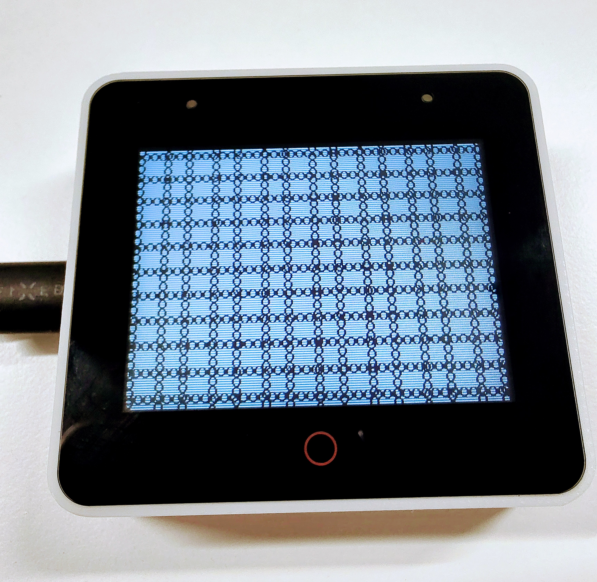

<a name="readme-top"></a>

<!-- PROJECT LOGO -->
<br />
<div align="center">
  <a href="https://github.com/sambenko/esp32s3-box-examples">
    
  </a>

<h3 align="center">ESP32S3-BOX Examples</h3>

  <p align="center">
    A repository of examples for esp32s3-box written in Rust
  </p>
</div>

## Usage

* hello world

```sh
   cargo espflash --release --monitor
```

<div align="center">
  <a href="https://github.com/sambenko/esp32s3-box-examples">
    
  </a>
</div>

<br/><br/>
<br/><br/>

* esp demo animation

```sh
   cargo espflash --release --example esp_demo
```

<div align="center">
  <a href="https://github.com/sambenko/esp32s3-box-examples">
    
  </a>
</div>

<br/><br/>
<br/><br/>

* squares animation

```sh
   cargo espflash --release --example squares
```

<div align="center">
  <a href="https://github.com/sambenko/esp32s3-box-examples">
    
  </a>
</div>

<br/><br/>
<br/><br/>

* eye (esp art no.1)

```sh
   cargo espflash --release --example eye
```

<div align="center">
  <a href="https://github.com/sambenko/esp32s3-box-examples">
    
  </a>
</div>

<br/><br/>
<br/><br/>

* lollipop guy (esp art no.2)

```sh
   cargo espflash --release --example lollipop_guy
```

<div align="center">
  <a href="https://github.com/sambenko/esp32s3-box-examples">
    
  </a>
</div>

<br/><br/>
<br/><br/>

* ESP garden (esp art no.3)

```sh
   cargo espflash --release --example garden
```

<div align="center">
  <a href="https://github.com/sambenko/esp32s3-box-examples">
    
  </a>
</div>

<p align="right">(<a href="#readme-top">back to top</a>)</p>

<br/><br/>
<br/><br/>

* ESP In Chains

```sh
   cargo espflash --release --example chains
```

<div align="center">
  <a href="https://github.com/sambenko/esp32s3-box-examples">
    
  </a>
</div>

<p align="right">(<a href="#readme-top">back to top</a>)</p>
